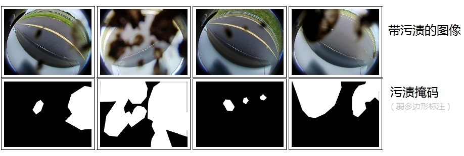
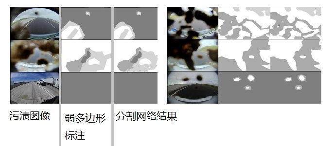
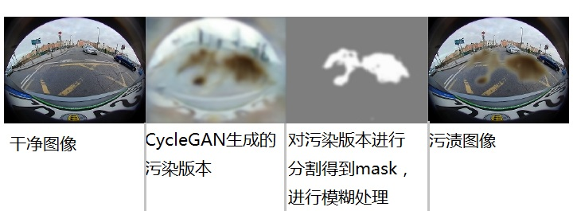
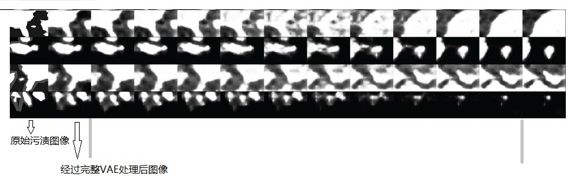
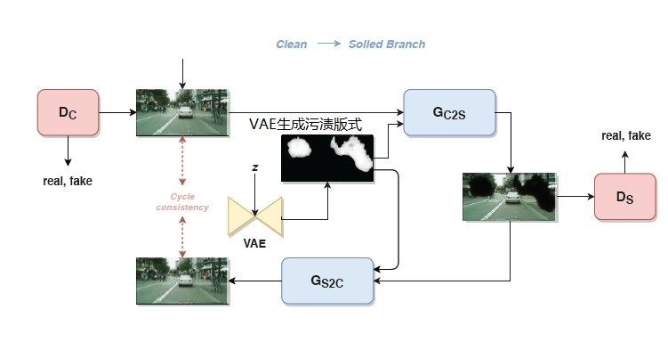
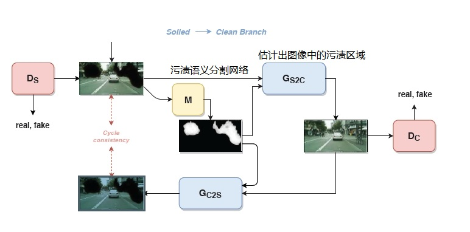

《Let's Get Dirty: GAN Based Data Augmentation for Soiling and Adverse Weather Classification in Autonomous Driving》    
DirtyGAN：自动驾驶中**基于GAN的数据增广**技术用于广角鱼眼镜头污渍检测和不利天气分类，是一个基于生成对抗网络（GAN）的算法，旨在解决自动驾驶中相机镜头污渍的问题。   
https://github.com/valeoai/woodscape    
一种基于 GAN 的算法，用于生成看似被污渍的图像（以扩充数据集，使得模型能够更好地检测污渍）。此外，该方法还自动提供相应的污渍掩码，从而消除了手动标注的成本。   

在自动驾驶中，广角鱼眼相机常用于停车和低速导航任务。这些相机直接暴露在恶劣的环境条件下，容易被泥浆、灰尘、水和霜冻污渍。
相机镜头上的污渍会严重降低视觉感知算法的性能，因此越来越多地部署了由污渍检测算法触发的相机清洁系统。  

## DirtyGAN的组成    
生成对抗网络（GAN）：DirtyGAN使用GAN模型，其中包括生成器和判别器。   
+ 生成器：生成器负责生成看似被污渍的图像。它学习从干净图像到污渍图像的映射。   
+ 判别器：判别器用于区分真实污渍图像和生成的污渍图像。     

### 实现步骤    
+ 使用干净图像作为输入，生成器生成看似被污渍的图像。   
+ 生成器还自动提供相应的污渍掩码，消除了手动注释的成本。   
+ 生成的污渍图像用于训练，从而显著提高了污渍检测任务的准确性。    

## 生成器（Generator）   
生成器是DirtyGAN的核心部分，负责生成看似被污渍的图像。

## 生成器的组成部分    
+ 输入    
  生成器接收一个输入，通常是干净的图像（没有污渍）。这个输入图像将被转换为看似被污渍的版本。    
+ 卷积神经网络（CNN）    
  生成器通常使用卷积神经网络（CNN）来处理图像。CNN具有多个卷积层和池化层，用于学习图像的特征。
+ 污渍生成        
  生成器的目标是生成具有类似污渍的纹理、斑点或瑕疵的图像。它通过学习从干净图像到污渍图像的映射来实现这一目标。
+ 噪声注入    
  生成器可能会添加一些随机噪声，以增加图像的真实感。这有助于使生成的图像看起来更自然，更类似于实际被污渍的图像。
+ 输出    
  生成器的输出是一个看似被污渍的图像，可以用于训练污渍检测算法。

## 判别器    
判别器在GAN中的作用类似于一个分类器。它的任务是`区分真实数据（例如干净的图像）和生成器生成的数据（看似被污渍的图像）`。    
判别器在DirtyGAN中起到了关键作用，帮助生成器生成更逼真的看似被污渍的图像。   

## 判别器的工作原理    
+ 判别器接收输入数据，并尝试判断它是真实数据还是生成的数据。它可以使用适合于所分类数据类型的任何网络架构。   
+ 判别器的训练：          
  在训练过程中，判别器首先学会区分明显的假数据。    
  随着训练的进行，生成器逐渐生成更接近真实数据的输出。    
  如果生成器训练良好，判别器开始难以区分真实数据和生成的数据，其准确性下降。     

## 判别器和生成器的关系    
生成器和判别器都是神经网络。生成器的输出直接连接到判别器的输入。通过反向传播，判别器的分类结果提供信号，生成器根据这些信号更新权重。

------------------------------------------------------   

污渍生成pipeline的核心是由 CycleGAN 网络形成，我们训练它执行 `从干净图像到其被污渍的对应图像` 的图像到图像的转换。CycleGAN 方法的主要问题是它修改了整个图像。对于我们期望的应用，这可能会在生成的图像中产生不希望的伪影。除此之外，生成的合成污渍模式通常相对逼真。

接下来，我们使用污渍的弱多边形annotation训练一个污渍语义分割网络 M。      
基于弱多边形annotation WoodScape 数据集   
    

尽管弱多边形 annotation 相当粗糙，但分割网络 M 能够更精确地适应污渍模式。     
    

我们使用 WoodScape 数据集来训练污渍分割网络。我们训练了**一个超分辨率网络 U** ，我们用它将 GAN 生成的图像转换为原始图像分辨率（即，上采样的 4× 因子）。人工污渍合成如下：  
    

干净图像 I作为`干净图像转换为污渍图像的生成器（G_C2S）`的输入，输出一个带有随机污渍模式的图像 Is。接下来，我们获得污渍掩码 m。这是通过在生成的污渍图像上应用语义分割网络，再应用高斯平滑滤波器r：`m = r(M(Is))`。结果的污渍掩码 m 是一个值在 `[0, 1]` 范围内的图像，其中 0 表示背景，1 表示污渍。中间值可以被理解为半透明的污渍。我们应用高斯平滑滤波器，因为它模拟了污渍现象的物理性质。最后，原始图像的人工污渍版本 ˆI 是原始图像 I 和污渍模式 Is 通过估计的掩码 m 的组合：  
```
ˆI = (1 − U (m)) · I + U (m) · U(Is) 
```

注意，一旦我们获得了Is 和 m，就可以使用任意图像进行最终的合成。通过语义分割网络M获得的掩码m作为生成图像中污渍的自动注释。这个简单的流程有一些限制。最大的一个是，它不能预期对由水（例如，雨滴，雪）引起的污渍类型在这种特定的配方中顺利工作。处理这个问题的一个选项是使用整个图像模拟水滴的反射模式，并相应地应用滤波器和转换。另一个选项是制定一个类似CyleGAN的方法，它可以应对只改变与污渍模式相对应的图像部分，并保持其余部分不变。     

在人工污渍合成中应用CycleGAN的问题有2个方面。  
+ 首先，CycleGAN并没有将图像生成限制在任何特定的区域，而是重新生成整个图像，影响所有的像素。在人工污渍生成的情况下，这是非常不可取的。为了研究污渍对进一步图像处理的影响，背景（即，图像中未受污渍影响的区域）必须保持不变。  
+ 其次，**“干净”到“污渍”** 的生成分支是不明确的，因为没有视觉线索可以指示应该在哪里产生污渍。可能会产生无穷多的模式。此外，对污渍模式的生成过程也没有控制。

第一个问题可以通过 InstaGAN 来解决。     
在这种情况下，第二个问题变得更为重要。我们通过 **变分自编码器（VAE）** 来引导掩码生成过程，**并修改CycleGAN算法**，**使其只应用在源和目标域图像的掩蔽区域**，我们将提出的网络命名为DirtyGAN。

>在 DirtyGAN 中，VAE的主要作用是生成掩码，这个掩码用于指导 CycleGAN 生成与掩码相对应的污渍。具体来说，VAE 生成的掩码和源域以及目标域图像的相应区域一起，被送入到 CycleGAN 中进行训练。这样，DirtyGAN 可以在指定的区域内生成更具针对性的污渍效果。

我们使用WoodScape数据集中的弱多边形污渍 annotation 来训练VAE。使用VAE生成污渍模式的主要思想如下。通过使用训练过的VAE的编码器，我们可以将数据集中的实际样本投影到低维表示。如果我们选择两个在污渍模式流形上接近的样本z1和z2，我们可以通过取它们的凸组合来获得一个新的样本z。   
```
z=νz1+(1−ν)z2
```
其中 ν∈[0,1]。然后，取这个中间表示z并应用训练过的VAE的解码器来重构相应的污渍模式。下图描绘了几个这种中间污渍模式重构的例子。     
      

使用从学习到的VAE中采样的好处是，我们甚至可以使用它来创建动画遮罩，例如，模拟动态污渍效果，如大雨中的水滴，或者能够研究动态污渍的影响。  
在训练了VAE之后，我们限制CycleGAN只能应用在  
+ _生成的“干净”到“污渍”变迁的遮罩_
+ _由污渍语义分割遮罩M获得的遮罩相对应的遮罩区域（掩码估计）_

原始的 CycleGAN 是一种无监督的图像到图像转换网络，它可以学习将来自一个领域的图像转换为另一个领域的图像，而无需成对的训练样本。      
改进的 CycleGAN 方案，该方案在生成新的污渍模式时使用了变分自编码器（VAE），并在相反的分支中使用了掩码。在这个改进的方案中，VAE 被用于生成新的污渍模式。VAE 是一种生成模型，它使用概率编码器和解码器来生成新的数据样本。在这里，VAE 被用于生成新的、未见过的污渍模式，这对于自动驾驶车辆的摄像头镜头污渍检测任务非常有用。    
另一方面，掩码估计被用于相反的分支。在这个上下文中，它可以估计出图像中的污渍区域，从而帮助网络更好地理解和生成污渍模式。

下图描绘了整个DirtyGAN方案    
     
   


CycleGAN    
https://github.com/yunjey/mnist-svhn-transfer/tree/master   

