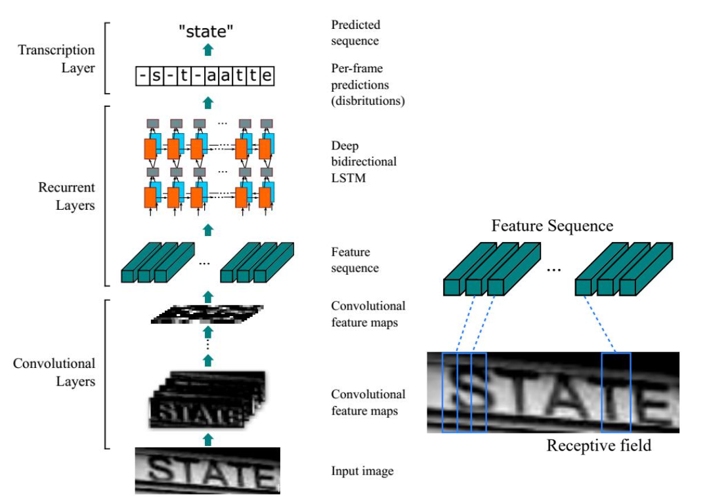
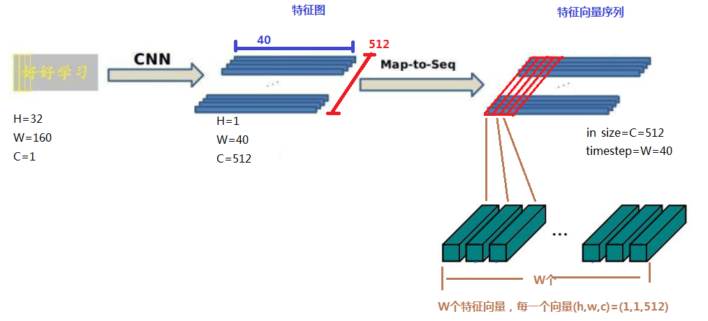
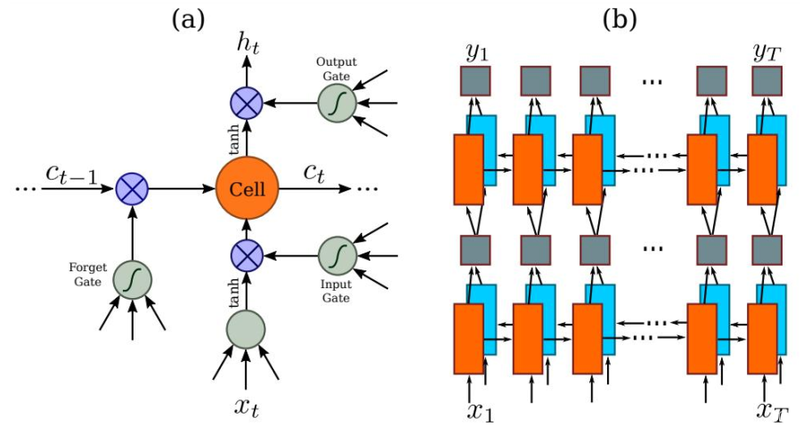
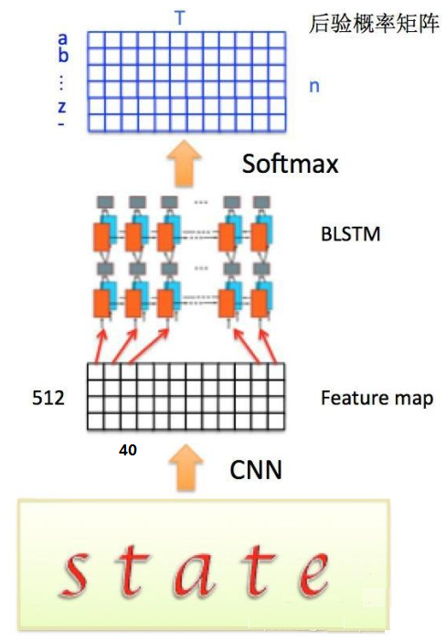
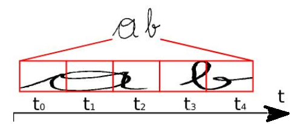
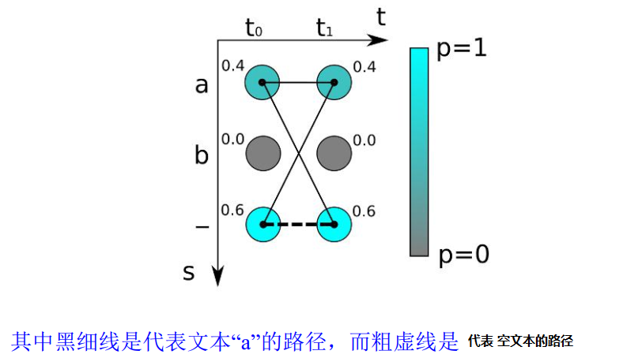
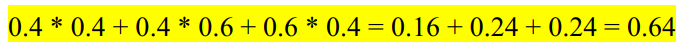
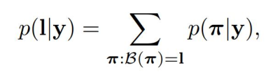
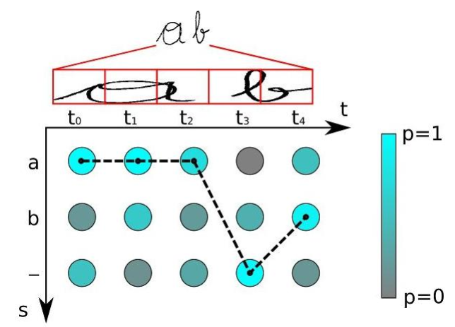

## 网络组成     
     
+ CNN卷积层：使用深度 CNN对输入图像提取特征，得到**特征图**    
+ map2seq：特征图到**特征序列**（由特征向量组成）    
+ RNN循环层：使用双向 RNN对特征序列进行预测，对序列中的每个特征向量进行学习并输出预测标签(真实值)分布  
+ CTC 转录层：使用 CTC 损失把从循环层获取的一系列标签分布转换成最终的标签序列

## cnn   
几点约束：   
+ 输入图像为灰度图像-单通道；       
+ 高度为32，这是固定的，**图片通过 CNN 后，高度就变为 1**，这点很重要；       
+ 宽度为160，宽度也可以为其他的值，但需要统一，所以输入 CNN 的数据尺寸为 **(channel, height, width)=(1, 32, 160)**       
+ CNN 的输出尺寸为 **(512, 1, 40)**，即 CNN 最后得到 512 个特征图，每个特征图的高度为 1，宽度为 40    

注意：  
最后的卷积层是一个 `2*2, s=1, p=0` 的卷积，此时相当于将 feature map 放缩为原来的 1/2，所以整个 CNN 层将图像的 h 放缩为原来的`1/(2^4)*2 = 1/32`，所以最后 CNN 输出的 feature map 的高度为1。   
```py
assert imgH % 16 == 0,'imgH has to be a multiple of 16'
```   
在程序中，图像的 h 必须为 16 的整数倍。    

```py   
assert h == 1, 'the height of conv must be 1'  
```   
前向传播时，CNN 得到的 feature map 的 h 必须为 1。       
最后 CNN 得到的 feature map 尺度为 `512x1x40`     

## map2seq    
      
不能直接把 CNN 得到的特征图送入 RNN 进行训练的，需要进行一些调整，根据特征图提取 RNN 需要的特征向量序列。    
现在需要从 CNN 模型产生的特征图中提取特征向量序列，每一个特征向量（如图中的一个红色框）在特征图上**按列**从左到右生成，每一列包含 512 维特征，这意味着第 i 个特征向量是所有的特征图第 i 列像素的连接，这些特征向量就构成一个序列。 **一共有W个特征向量，这里W=40，每一个特征向量长度为512**。       

由于卷积层，最大池化层和激活函数在局部区域上执行，因此它们是平移不变的。因此，特征图的每列（即一个特征向量）对应于原始图像的一个矩形区域（称为感受野），并且这些矩形区域与特征图上从左到右的相应列具有相同的顺序。特征序列中的每个向量关联一个感受野。    
这些特征向量序列就作为循环层的输入，每个特征向量作为 RNN 在一个时间步（time step）的输入。    

## rnn   
因为 RNN 有梯度消失的问题，不能获取更多上下文信息，所以 CRNN 中使用的是LSTM，LSTM 的特殊设计允许它捕获长距离依赖。   
LSTM 是单向的，它只使用过去的信息。然而，在基于图像的序列中，两个方向的上下文是相互有用且互补的。将两个 LSTM，一个向前和一个向后组合到一个双向 LSTM 中。此外，可以堆叠多层双向 LSTM，深层结构允许比浅层抽象更高层次的抽象。 
这里采用的是两层各 256 单元的双向 LSTM 网络：     
      
通过上面一步，我们得到了 40 个特征向量，每个特征向量长度为 512，在 LSTM 中一个时间步就传入一个特征向量进行分类，这里一共有 40 个时间步。 
我们知道一个特征向量就相当于原图中的一个小矩形区域，RNN 的目标就是预测这个矩形区域为哪个字符，即根据输入的特征向量，进行预测，得到所有字符的 softmax 概率分布，这是一个长度为字符类别数的向量，作为 CTC 层的输入。   
因为每个时间步都会有一个输入特征向量 xt，输出一个所有字符的概率分布 yt，所以输出为 40 个长度为字符类别数的向量构成的后验概率矩阵：        
     
然后将这个后验概率矩阵传入转录层。  

## ctc loss  
转录层，转录是将 RNN 对每个特征向量所做的预测转换成**标签序列**的过程。数学上，转录是根据每帧预测找到具有最高概率组合的标签序列。   
端到端 OCR 识别的难点在于怎么处理不定长序列对齐的问题！OCR 可建模为时序依赖的文本图像问题，然后使用 CTC（Connectionist Temporal Classification, CTC）的损失函数来对 CNN 和 RNN 进行端到端的联合训练。

+ 序列合并机制      
要将 RNN 输出的序列翻译成最终的识别结果，RNN 进行时序分类时，不可避免地会出现很多冗余信息，比如一个字母被连续识别两次，这就需要一套去冗余机制。     
     
比如要识别上面这个文本，其中 RNN 中有 5 个时间步，理想情况下 `t0, t1, t2` 时刻都应映射为 `a`，`t3, t4` 时刻都应映射为 `b`，然后将这些字符序列连接起来得到 `aaabb`，我们再将连续重复的字符合并成一个，那么最终结果为 `ab`。     
这似乎是个比较好的方法，但是存在一个问题，如果是 book，hello 之类的词，合并连续字符后就会得到 bok 和 helo，这显然不行，所以 CTC 有一个 `blank` 机制来解决这个问题。
我们以 `-` 符号代表 `blank`，RNN 输出序列时，在文本标签中的重复的字符之间插入一个 `-`，比如输出序列为 `bbooo-ookk`，则最后将被映射为 `book`，即有 `blank` 字符隔开的话，连续相同字符就不进行合并。    
即对字符序列先删除连续重复字符，然后从路径中删除所有 `-` 字符，这个称为解码过程，而**编码则是由神经网络来实现**。引入 `blank` 机制，我们就可以很好地解决重复字符的问题。
相同的文本标签可以有多个不同的字符对齐组合，例如，aa-b 和 aabb 以及 -abb 都代表相同的文本 (ab)，但是与图像的对齐方式不同。更总结地说，一个文本标签存在一条或多条的路径。

+ 训练阶段      
在训练阶段，我们需要根据这些概率分布向量和相应的文本标签得到损失函数，从而训练神经网路模型，下面来看看如何得到损失函数的。         
      
如上图，对于最简单的时序为 `2` 的字符识别，有两个时间步长 `(t0，t1)` 和三个可能的字符为 `a`，`b` 和 `-`，我们得到两个概率分布向量，如果采取最大概率路径解码的方法，则 `--` 的概率最大，即真实字符为空的概率为 0.6*0.6=0.36。
但是为字符 `a` 的情况有多种对齐组合，`aa`, `a-` 和 `-a` 都是代表 `a`，所以，输出 `a` 的概率应该为三种之和：      
      
所以 `a` 的概率比`空 -` 的概率高！如果标签文本为 `a`，则通过计算图像中为 `a` 的所有可能的对齐组合（或者路径）的分数之和来计算损失函数。
所以对于 RNN 给定输入概率分布矩阵为 y={y1,y2,…,yT}，T是序列长度，最后映射为标签文本l的总概率为：       
      
其中 B(π) 代表从序列到序列的映射函数 B 变换后是文本 l 的所有路径集合，而 π 则是其中的一条路径。每条路径的概率为各个时间步中对应字符的分数的乘积。     
我们就是需要训练网络使得这个**概率值最大化**，类似于普通的分类，CTC 的损失函数定义为概率的负最大似然函数，为了计算方便，对似然函数取对数。   
通过对损失函数的计算，就可以对之前的神经网络进行反向传播，神经网络的参数根据所使用的优化器进行更新，从而找到最可能的像素区域对应的字符。   
这种通过映射变换和所有可能路径概率之和的方式使得 CTC 不需要对原始的输入字符序列进行准确的切分。  

+ 测试阶段      
在测试阶段与训练阶段有所不同，我们用训练好的神经网络来识别新的文本图像。这时候我们事先不知道任何文本，如果我们像上面一样将每种可能文本的所有路径计算出来，对于很长的时间步和很长的字符序列来说，这个计算量是非常庞大的，这不是一个可行的方案。
我们知道 RNN 在每一个时间步的输出为所有字符类别的概率分布，即一个包含每个字符分数的向量，我们取其中最大概率的字符作为该时间步的输出字符，然后将所有时间步得到一个字符进行拼接得到一个序列路径，即最大概率路径，再根据上面介绍的合并序列方法得到最终的预测文本结果。
在输出阶段经过 CTC 的翻译，即将网络学习到的序列特征信息转化为最终的识别文本，就可以对整个文本图像进行识别。        
      
比如上面这个图，有 5 个时间步，字符类别有 a, b, -(blank)，对于每个时间步的概率分布，都取分数最大的字符，所以得到序列路径 aaa-b，先移除相邻重复的字符得到 a-b，然后去除 blank 字符得到最终结果：`ab`。

----------------------------    

预测过程中，先使用标准的 `CNN` 网络提取文本图像的特征，再利用 `BLSTM` 将特征向量进行融合以提取字符序列的上下文特征，然后得到每列特征的概率分布，最后通过 `CTC` 进行预测得到文本序列。利用 BLSTM 和 CTC 学习到文本图像中的上下文关系，从而有效提升文本识别准确率，使得模型更加鲁棒。    

在训练阶段，CRNN 将训练图像统一缩放为 `w×32（w×h）`，在测试阶段，针对字符拉伸会导致识别率降低的问题，CRNN保持输入图像尺寸比例，但是图像高度还是必须统一为 **32**个像素，卷积特征图的尺寸动态决定 LSTM 的时序长度（时间步长）。    


## Ref    
https://blog.csdn.net/xiaosongshine/article/details/112198145    


