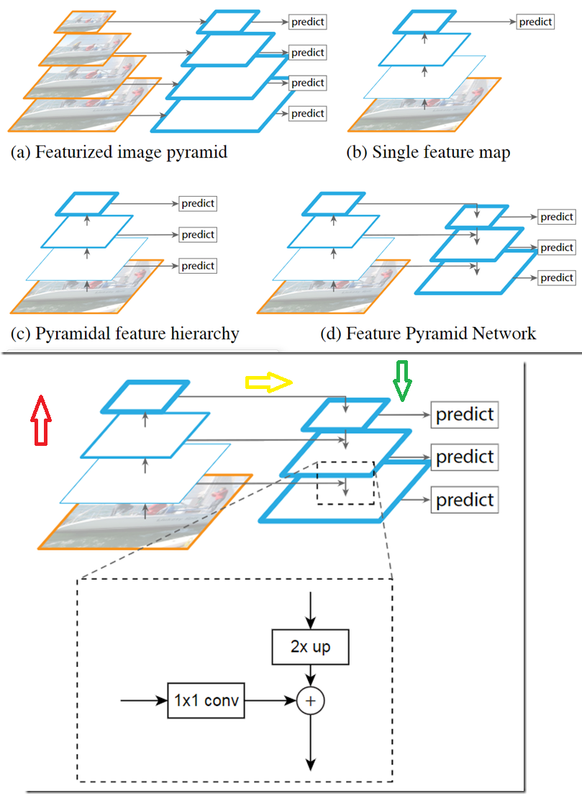

(a) **图像金字塔**    
在传统图像处理算法中用得比较多，就是将图片resize到不同的大小，然后分别得到对应大小的特征，然后进行预测。这种方法虽然可以一定程度上解决多尺度的问题，但是很明显，带来的计算量也非常大。

(b) **使用单个feature map进行检测**  
这种结构在17年的时候是很多人在使用的结构，比如YOLOv1、YOLOv2、Faster R-CNN中使用的就是这种架构。直接使用这种架构导致预测层的特征尺度比较单一，对小目标检测效果比较差。

(c) 像SSD（Single Shot Detector）采用这种**多尺度特征融合的方式**   
没有上采样过程，即从网络不同层抽取不同尺度的特征做预测，这种方式不会增加额外的计算量，但是不同的层次的特征图有巨大的语义差距，高分辨率的特征图只有低级特征，损害了表示能力，不利于目标识别。作者认为SSD算法中没有用到足够低层的特征（在SSD中，最低层的特征是VGG网络的conv4_3），而在作者看来足够低层的特征对于检测小物体是很有帮助的。

(d) **经典FPN架构**   
通过自上而下和自下而上的路径来构建特征金字塔。自下而上的路径是指从底层特征图开始，通过下采样操作逐渐减小特征图的分辨率，同时增加其语义信息。自上而下的路径是指从顶层特征图开始，通过上采样操作逐渐增加特征图的分辨率，还引入了横向连接，用于在自上而下和自下而上的路径之间传递信息，高层特征图通过1x1卷积进行降维后与低层特征图进行融合，以产生具有更好分辨率和语义信息的金字塔特征。

    

+ 一个自底向上的线路  
+ 一个自顶向下的线路  
+ 横向连接（lateral connection）  

图中放大的区域就是横向连接，这里1*1的卷积核的主要作用是减少feature map通道数和向下的路径匹配。

自底向上其实就是网络的前向过程。在前向过程中，feature map的大小在经过某些层后会改变，而在经过其他一些层的时候不会改变，作者将不改变feature map大小的层归为一个stage，因此每次抽取的特征都是每个stage的最后一个层输出，这样就能构成特征金字塔。本论文用ResNet作为backbone，将每个stage的输出命名为Ci，i代表是bacbone中的哪个stage，如论文采用{C2,C3,C4,C5}对应的下采样的倍数为{4,8,16,32}，因为考虑到内存占用，没用到C1。     
自顶向下的过程采用上采样（upsampling）进行，而横向连接则是将上采样（一般用简单的最近邻插值）的结果和自底向上生成的相同大小的feature map进行融合（merge）。在融合之后还会再采用3*3的卷积核对每个融合结果进行卷积，目的是消除上采样的混叠效应（aliasing effect）。并假设生成的feature map结果是P2，P3，P4，P5，和原来自底向上的卷积结果C2，C3，C4，C5一一对应。
